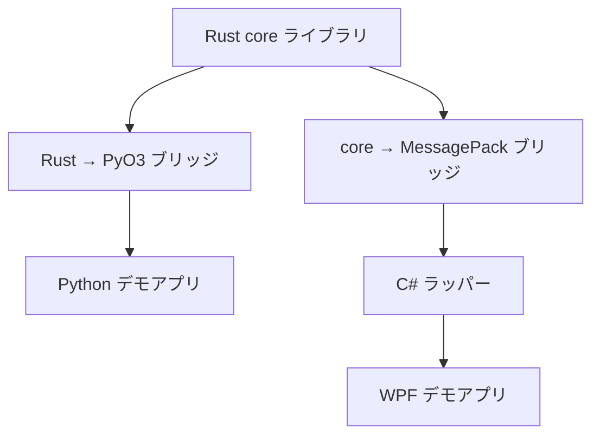

# rust-bridge-demos

このリポジトリは、**Rust で実装したコアライブラリを、複数の言語・ランタイムから再利用するための実践的なデモ集**です。

単なるサンプルではなく、

- 設計の分離
- データモデルの扱い
- ブリッジ方式ごとの特性

を比較・検証できる構成を目的としています。

---

## 目的

本リポジトリの目的は以下の通りです。

- Rust を **コアロジックの実装言語**として固定する
- 異なるブリッジ方式を **並列に比較**する
- 実務でそのまま応用可能な構成を提示する

---

## 全体構成

```
rust-bridge-demos/
├─ core/ # Rust コアライブラリ（domain + APIモデル）
├─ py-bridge/ # Rust → PyO3 ブリッジ
├─ py-demo/ # Python デモアプリケーション
├─ messagepack-bridge/ # core → MessagePack（C ABI）
├─ dotnet-bridge/ # messagepack-bridge の C#向け ラッパー（P/Invoke）
├─ dotnet-demo/ # WPF デモアプリケーション
└─ docs/ # 設計メモ・補足資料
```



---

## Rust コア (`core/`)

- ビジネスロジック・計算ロジックの本体
- **特定の言語や UI に依存しない**
- IF 用の API モデルは domain モデルと分離

Rust は「唯一の真実（Single Source of Truth）」として扱います。

---

## Python 向けブリッジ（PyO3）

### `py-bridge/`

- Rust コアを PyO3 で Python モジュールとして公開
- Python からは通常のライブラリとして利用可能
- 名前変更案: `core-py-bridge`

### `py-demo/`

- Python から Rust ライブラリを呼び出すデモ
- 可視化や簡易 UI を想定
- 名前変更案: `core-py-demo`

---

## .NET 向けブリッジ（MessagePack + C ABI）

### `messagepack-bridge/`

- Rust の C ABI を公開
- 入出力は **MessagePack バイナリ**
- 言語非依存な I/F を提供
- 名前変更案: `core-ffi-bridge`

### `dotnet-bridge/`

- C# 側の P/Invoke ラッパー
- MessagePack のシリアライズ／デシリアライズを担当
- ネイティブ呼び出しを完全に隠蔽
- 名前変更案: `core-dotnet-bridge`

### `dotnet-demo/`

- WPF を用いたデモアプリケーション
- Rust エンジンの結果を視覚的に確認可能
- 名前変更案: `core-dotnet-demo`
