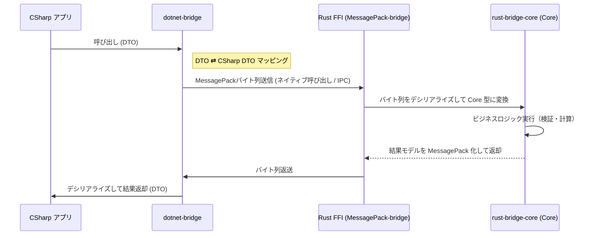

# README.md

### シーケンス図

```mermaid
sequenceDiagram
    participant CSharp as CSharp アプリ
    participant DotNet as dotnet-bridge
    participant RustFFI as Rust FFI (MessagePack-bridge)
    participant Core as rust-bridge-core (Core)

    CSharp->>DotNet: 呼び出し (DTO)
    Note right of DotNet: DTO ⇄ CSharp DTO マッピング
    DotNet->>RustFFI: MessagePackバイト列送信 (ネイティブ呼び出し / IPC)
    RustFFI->>Core: バイト列をデシリアライズして Core 型に変換
    Core->>Core: ビジネスロジック実行（検証・計算）
    Core-->>RustFFI: 結果モデルを MessagePack 化して返却
    RustFFI->>DotNet: バイト列返送
    DotNet->>CSharp: デシリアライズして結果返却 (DTO)
```
